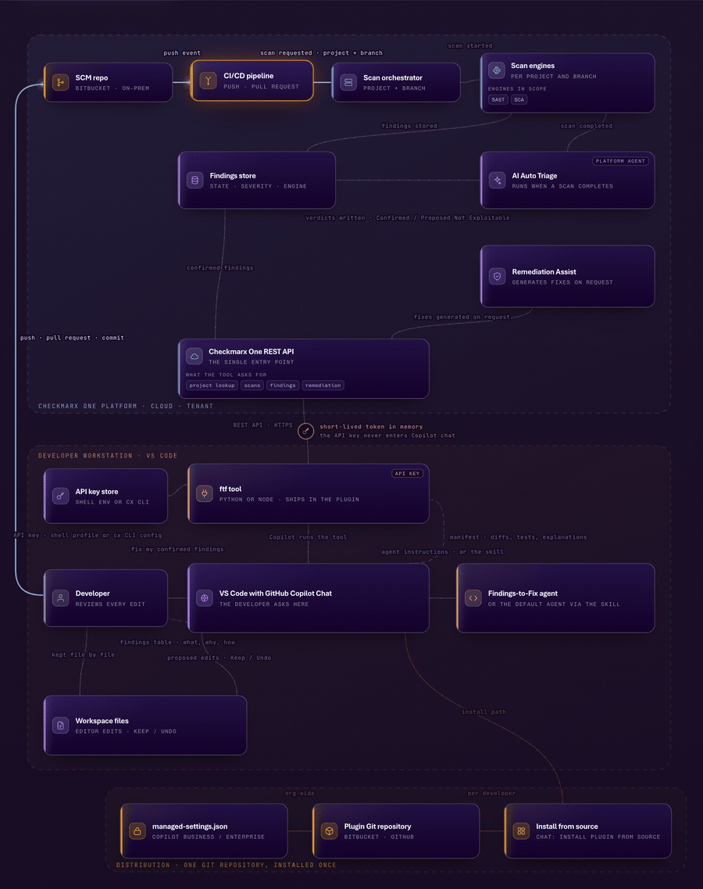

# Findings-to-Fix for Claude Code

Built on Checkmarx One **Triage Assist** and **Remediation Assist**, working inside
Claude Code. Triage Assist has already evaluated the findings on the platform
using Attackability-based context (reachability, exploitability, code context,
policy signals) and confirmed the ones that require action. The plugin takes only
those confirmed findings, asks Remediation Assist to generate the review-ready
fix, and shows you each change as a diff to accept or reject. The agent proposes;
you approve.

You run one command. It pulls only the findings Triage Assist has confirmed,
asks Remediation Assist for the fix, and Claude shows you each change. That is
the whole thing.

Using GitHub Copilot instead? Use
[cx-findings-to-fix](https://github.com/cx-israel-ogunsakin/cx-findings-to-fix),
the Copilot version of this same plugin.

<p align="center">
  <a href="docs/findings-to-fix-architecture-animated.html">
    
  </a>
  <br>
  <sub>The ten steps, from a scan to a reviewed fix. Interactive version:
  <a href="docs/findings-to-fix-architecture-animated.html">docs/findings-to-fix-architecture-animated.html</a>
  (download and open in a browser). Full guide:
  <a href="docs/Findings-to-Fix.pdf">docs/Findings-to-Fix.pdf</a>.</sub>
</p>

## Getting started

You need three things once. After that it is just running the command.

### 1. A Checkmarx One API key on your machine

Ask your Checkmarx admin for an API key. Then either

- put it in your shell profile: `export CX_APIKEY=<your key>`, or
- if you already use the Checkmarx `cx` command line tool:
  `cx configure set --prop-name cx_apikey --prop-value <your key>`

Findings-to-Fix reads it from either place. It never shows the key to Claude.

### 2. Python or Node on your machine

Either one works, and the plugin picks whichever it finds. Most Macs and Linux
machines already have Python 3. On Windows, note that a fresh machine has a
`python3` that is only a Microsoft Store shortcut, not Python; the plugin
detects that and uses Node instead, so having Node installed is enough.

### 3. Install the plugin

```
claude plugin marketplace add cx-israel-ogunsakin/cx-findings-to-fix-claude
claude plugin install cx-findings-to-fix@cx-findings-to-fix-claude
```

(For a private copy of this repository, use its Git URL or a local folder path
in the first command.) You will see a short "Findings-to-Fix is installed" note
when a session starts.

## Using it

1. Open a terminal in the project you want to fix (or open it in VS Code or
   JetBrains with the Claude Code extension) and start `claude`.
2. Type `/cx-f`, press Tab to complete, then Enter. You can add the project
   name and branch after the command to skip the questions:
   `/cx-findings-to-fix:fix CxRW-Sandbox/ProjectHub9 feat/update-routes`

Claude will:

- work out which Checkmarx project and scan this is. If the project name does
  not match your git setup, it lists the likely projects and asks you to pick.
  If only one branch has scans (common for monorepos and zip uploads, where
  Checkmarx files scans under the branch name `.unknown`), it uses that and
  tells you. If several branches have scans and yours is not one of them, it
  lists them with dates and asks. It never guesses.
- fetch the fixes from Checkmarx (a couple of minutes the first time, seconds
  after that).
- show you a table of the confirmed findings and ask which to apply.
- propose each change as an edit you accept or reject, file by file.
- explain what each fix does and why.
- offer to run the tests Checkmarx generated for the fix.

Nothing is committed or pushed. You review, then commit as usual.

## Good to know

- Only findings that Checkmarx Triage Assist has marked **Confirmed**, at
  critical or high severity, are fixed. Nothing else is touched.
- If you edited a file near the vulnerable code since the last scan, Claude
  places the fix into your current code by hand instead of applying it
  blindly, and tells you so. Your edits stay.
- It works whether your project folder is a git clone or a plain folder.
- Monorepos: if you open one service's folder rather than the whole repo,
  you see only the findings under that folder, and it tells you how many the
  project has in total. Ask for "all findings" to see everything.
- Package (SCA) fixes are supported but off by default. Ask Claude to
  "include package fixes" if you want them.
- The first run asks you to allow the plugin's command; that is Claude Code's
  normal permission prompt for running a tool.
- If something is missing (no API key, expired key, feature not enabled on
  your tenant), Claude tells you exactly what and how to fix it.

## For admins: rolling it out to a team

Put this repository somewhere your developers can reach (GitHub, Bitbucket, an
internal Git server). Each developer runs the two install commands once with
that URL. Claude Code's managed settings can pre-approve the marketplace for
everyone.

## What is in this repository

Each file has exactly one job.

```
cx-findings-to-fix-claude/
├── .claude-plugin/
│   ├── plugin.json           ← "this is a plugin": name, version, description
│   └── marketplace.json      ← "this repo is a marketplace that serves this plugin"
├── commands/fix.md           ← the /cx-findings-to-fix:fix command (the protocol)
├── agents/findings-to-fix.md ← a subagent with the same protocol, for delegation
├── skills/fix-confirmed-findings/
│   ├── SKILL.md              ← the same protocol as a skill (triggers on phrasing)
│   ├── ftf.py                ← the tool: all the deterministic work
│   └── ftf.js                ← the identical tool, for machines without Python
├── hooks/
│   ├── hooks.json            ← "run check-auth.sh when a session starts"
│   └── check-auth.sh         ← the session note and the API key warning
└── docs/                     ← the guide (PDF), how-it-works, architecture page, screenshots
```

The split that matters: **markdown decides, code does.** The command, the
subagent, and the skill are the same protocol written for three entry points,
and they hold all the judgment (ask rather than guess, propose rather than
write, offer the tests once). The tool holds none: it talks to Checkmarx One,
computes fixes against your files, and prints JSON. That line is why a run
costs cents and behaves the same every time.

Nothing runs on a server. Nothing is installed besides this folder. The tool
(`ftf.py` / `ftf.js`) is identical to the one in the Copilot repository; that
repository is where it is maintained.

## Support

Questions and issues: open an issue in this repository.
